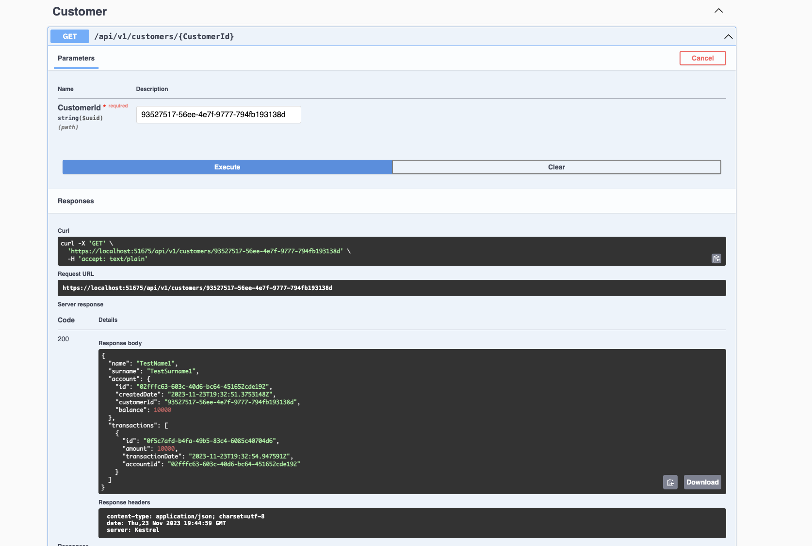

# Account.Api

## Account.Api in a Nutshell

Account.Api is basically a WebApi that has 3 main endpoints to perform such as Create Account, Get Transactions of Account and Get Customer.

This application is developed with .NET 6.

This application has 4 main layers inside the project such as :

- Application
- Dommain
- Infrastructure
- WebApi

Responsibilities of the layers :

Application:

This layer is responsible for coordinating and delegating the requested logic by the presentation layer (WebApi). Mainly this layer gets the Mediatr request and sends this parammeters to the services that is performing the logic and returns the handled result.

In this project, its responsible to get the Mediatr Request, check its validation by Mediatr PipelineBehavior and send this request to the services that are in Infrastructure layer (which its interface is defined in Domain Layer) and returning the result after the logic is performed.

Infrastructure:

This layer is responsible for having the Repository layer of the project. There are 3 main repositories : Account, Customer and Transaction.

Domain:

This layer is mainly responsible for having the Interfaces(contracts) of the business logics that is defined in Infrastructure layer and enable projects to commmunicate with Interfaces not with the implementation itself.

WebApi:

This layer is having controllers. Mediator is used inside the controllers to keep the controller layer simple and clean.

## How to Run Account.Api Locally

It is possible to run the application with **docker-compose**. 

Either docker-compose can be ran with Visual Studio or use below command on your terminal to run the project: 

`docker-compose up`

## Account.Api Endpoints

There are 3 main endpoints in Account.Api these are can be observed via Swagger : 

- api/v1/accounts (POST)

This endpoint is responsible for creating account for existing customer with given parameters `customerId` and `initialCredit`. If `initialCredit` is greater than 0, a new `Transaction` will be also created for newly created account. 

Here is the example call on Swagger: 

- api/v1/accounts/transactions/{AccountId} (GET)

This endpoint is responsible for getting the list of transactions of given Account Id. 

Here is the example call on Swagger: 

- api/v1/customers/{CustomerId} (Get)

This endpoint is responsible for returning customer informations such as Name, Surname and account and account's transactions informations.

Here is the example call on Swagger: 

## Account.Api Tests

Unit tests are written with NUnit and Moq for below layer : 

- Application.Tests : All the handlers' business logics are covered in Application layer.

## (Hypotetical) Deployment Steps

Account.Api is assumed as an application with Docker support and deployed to Azure AKS environment. 

Note: It's also assumed that the built docker application would be pushed into Azure Container Registry repository via this pipeline.

- helm-chart is created to demonstrate how application can be deployed inside k8s Cluster.
- azure-pipelines.yml is added with the main steps to build, test and push the Docker image of the application and deploy the application as helm-chart to Azure AKS environment.

## Test Datas

Here are test datas that is possible to use to test out the endpoints : 

Customerid1 : 93527517-56ee-4e7f-9777-794fb193138d

AccountId1 : 02fffc63-603c-40d6-bc64-451652cde192

Customerid2: 0d031dc6-e26e-4ed7-8424-7c6314695150

AccountId2: e976f964-aaa1-4e22-8f8c-d75bd355643a

## Technologies Used in Account.Api

- FluentValidation: Basically FluentValidation is a popular .NET Library for building strongly-typed validation rules. This library is used for implementing the validations in more easy, flexible, easy to understand, and easy to create a complex validation rule at once.
  FluentValidation's documentation can be accessed through here: "https://docs.fluentvalidation.net/en/latest/aspnet.html"

- Swagger (Swashbuckle): Swagger is an open source api documentation that helps us to understand API service methods. When we consume a web API, then understanding its various methods and verbs can be challenging for a developer. This solves the problem of generating documentation. Also "Swashbuckle" is used to perform Swagger operations in .net core environment.

- Mediatr: The MediatR library by Jimmy Bogard has become increasingly popular over recent years. By its own definition, it’s a simple, unambitious mediator implementation in .NET. Used Mediatr for decoupling application code from the top-level (presentation layer) code. Also getting benefit from its pipeline behaviors.

- AutoMapper : AutoMapper is used for mapping the objects from one to another. Here is the documentation : https://automapper.org/"

- GlobalExceptionHandler: This package is used for handling global exceptions in the project, here is the documentation of the package : "https://github.com/JosephWoodward/GlobalExceptionHandlerDotNet"

- Microsoft.EntityFrameworkCore.InMemory : This database provider allows Entity Framework Core to be used with an in-memory database. For more info : "https://learn.microsoft.com/en-us/ef/core/providers/in-memory/?tabs=dotnet-core-cli"

## Self Aproach

In the project I aimed to keep simple the WebApi and Controller simple as possible and less dependency. Used Mediator for handling the logic in the Application layer instead of calling the logic directly in WebApi layer. 

Also used Validation Pipeline Behavior to handle the request payload validation before the payload is "handled" by the logic. 

Used Microsoft.EntityFrameworkCore.InMemory to have in memory database and repositories inside the Infrastructure layer. In that way, eventhough its in memory database with this way the application became more closer to real project structure.

GlobalExceptionHandler package is used for handling validation exception or general exceptions and sends the response code with appropriate HttpStatusCode and message. In this way controller layer become more clean.

Since Azure Infrastructure/ DevOps is one of my strengths, I decided to create a hypotetical CI/CD pipeline with Azure assuming that the application is going to be deployed to Azure AKS to demonstrate the steps. 

Also helm chart (hypotetical) is used to deploy the application to demonstrate which steps I would follow to deploy the application to k8s environment.

Because frontend is not my strongest area and it might take time to buildup frontend application, I decided to skip this bonus point and decided to focus more on my stronger areas instead. 